<h1 style="color: #4D774E;">Cloud Fundamentals</h1>

---

<h2 style="color: #F1B24A;">Day 1 - Cloud Computing<h2>

#### November 7, 2020

**Focus**: The focus was on understanding what cloud computing is all about.

**Progress**:

- Creating free-tier account
- Leran the basics of cloud computing
- Learn about cloud deployment models
- Learn about the benefits of these models
- Learn about the shared responsibility model

**Thoughts**:\ Not much hands-on practice today. But learning about cloud computing is refreshing.

**Work & Resources**:\
[Shared Responsibility Model](https://aws.amazon.com/compliance/shared-responsibility-model/)

---

<h2 style="color: #F1B24A;">Day 2 - Foundational & Compute Service<h2>

#### November 8, 2020

**Focus**: The focus for today was on Virtual Private Cloud (VPC).

**Progress**:

- Learn the importance of the VPC
- Lean about subnets, route tables, security groups, internet gateway, etc
- Understanding the default VPC
- Understanding Region and Availability Zone, and their impact
- Creating custom VPC
- Launch EC2 instances and connect to then via ssh

**Thoughts**: Creating a custom VPC was challenging. With persistence and perseverance I was able to get it done. I am longer using the default VPC.

**Work & Resources**:\
[Virtual private cloud](https://en.wikipedia.org/wiki/Virtual_private_cloud)\
[Amazon VPC Documentation](https://docs.aws.amazon.com/vpc/latest/userguide/what-is-amazon-vpc.html)\

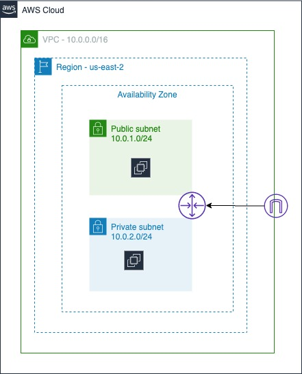

---

<h2 style="color: #F1B24A;">Day 3 - Foundational & Compute Service<h2>

#### November 9, 2020

**Focus**: No better way to start with AWS than EC2. Today the learning focuses on EC2 basics and some of the main features it offers. It also touches on storage, auto scaling and load balancing.

**Progress**:

EC2-Basics:

- Learned how to create EC2 instance
- Associate the instance with a security group that allows ssh traffic from any IP
- Create a snapshot of the EBS volume attached to the EC2 Instance
- Create an AMI using the snapshot
- Create a new instance using the AMI

Storage:

- Learn about the different storage class
- Create an EBS volume and attack it to instance
- Create an EFS filesystem and mount it to instance

S3 and IAM Role:

- Create an S3 bucket
- Create IAM Role with EC2 Service
- Attach AmazonS3FullAccess to policy
- Attach role when creating launch configuration

Auto scaling and Load Balancing

- Create launch configuration (useing ami-03657b56516ab7912)
- Create autoscaling group using the launch configuration
- Create target groups
- Create load balancer and have load balancer serves traffic to the instance
- Verify you can see webapp from your browser

**Thoughts**: Doing the lab was refreshing and really cement the concept for me. Navigating the console was a bit intimidating at first. With patience and dedication it becomes easier. Taking the time to draw the architecture prior immersing in the labs was instrumental in connecting the dots.

**Work & Resources**:

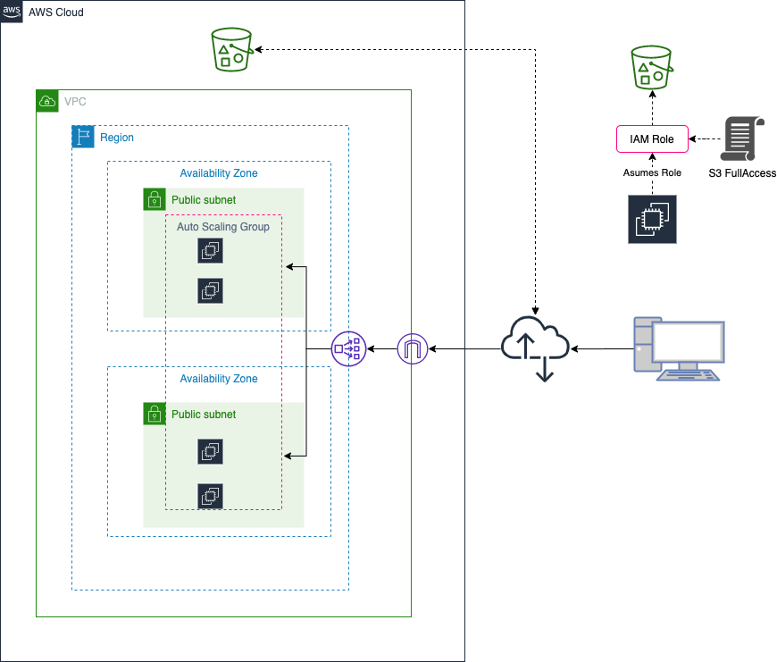

---

<h2 style="color: #F1B24A;">Day 4 - Foundational & Compute Service<h2>

#### November 10, 2020

**Focus**: The learning today was focuses on Lambda. I spent a good amount of time experimenting with the lambda function. I did things such as using the parameter passed to the function to stop and restart the instance. I even played around with API gateway that called the lambda function to bring the intance up/down.

## **Progress**

- Learn the basic of Lambda
- Review the concept of lambda function, event source downstream resources, and log stream
- Create lambda function using the python runtime
- Creaye IAM roles to give the lambda EC2 and cloudwatch access
- Code the lambda function to start/stop an EC2 instance
- Playing around with environment variables

**Thoughts**:

Today working with lambda was fun. I realized there are more to lambda than writing simple functions. It is one area I need to dedicate more time learning.

**Work & Resources**:

[Lambda Function](https://github.com/4zwazo/x-days-of-devops/blob/main/resources/code/lambda/start-start-ec2.py)

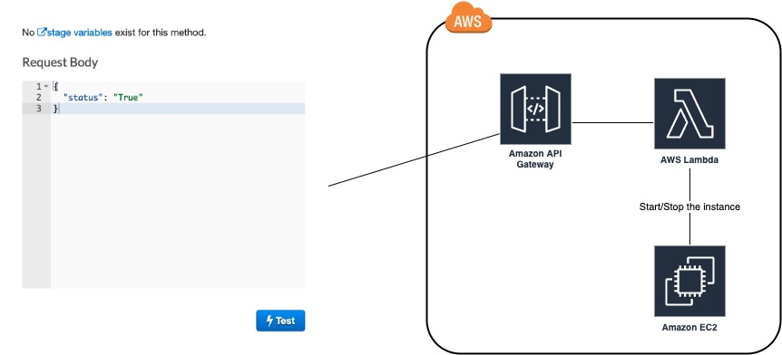

---

### Day 5 - AWS Management

#### November 11, 2020

**Focus**: The learning today focused on the AWS Command Line (CLI) Interface

**Progress**:

- Getting the raspberry pi up and running (no GUI)
- Install the AWS CLI SDK
- Playing around with the AWS CLI commands

**Thoughts**: Knowing which command to type to accomplish a tasks can be challenging. Reading the CLI documention is your best friend. You just have type experimenting with it. When you finally gets it, documenting somewhere.

**Work & Resources**:\
[AWS CLI on the Raspberry Pi](https://github.com/4zwazo/x-days-of-devops/blob/main/resources/cli/pi-install.md)\
[AWS CLI command reference guide](https://docs.aws.amazon.com/cli/latest/reference/)\
[AWS Command Line Interface (CLI)](https://docs.aws.amazon.com/cli/latest/userguide/cli-chap-welcome.html)

---

### Day 6 - Storage & Content Delivery

#### November 12, 2020

**Focus**: The learning today focused on S3, DynamoDB, RDS, and CloudFront. I focused in making sure I understand the concept well. I have completed all the labs. It was well worth my time.

**Progress**:

- Create a NoSQL database using DynamoDB
- Create a PostgreSQL database instance using RDS
- Connect and query the databases
- Create a S3 bucket and upload a simple web site to the bucket
- Create a CloudFront distribution for the website

**Thoughts**: The lab makes working with DynamoDB super fun.

**Work & Resources**:
[Introduction to CloudFront](https://www.qwiklabs.com/focuses/14183?catalog_rank=%7B%22rank%22%3A1%2C%22num_filters%22%3A0%2C%22has_search%22%3Atrue%7D&parent=catalog&search_id=7804775)

---

### Day 7 - Security

#### November 13, 2020

**Focus**: The learning today was on security. It stressed the needs on applying best practices to keep your environment and the application running in the cloud secured.

## **Progress**

- Create an IAM policy

**Thoughts** Today I read a few article about security. This is an important topic I need to immerse myself into.

**Work & Resources**:

[AWS Security Best Practices](https://d1.awsstatic.com/whitepapers/aws-security-best-practices.pdf)

---

### Day 8 - Messaging & Containers

#### November 14, 2020

**Focus**: The learning today was on SNS, SQS, and ECS.

## **Progress**

- Create a topic, Subscribe to a topic, and publish message to a topic
- Playing around with ECS and SQS

**Thoughts**: I had to spend a good chunk of time study SNS. It was a bit challenging getting the concept ingrained in my brain. As always go to the drawing board save the day.

**Work & Resources**:
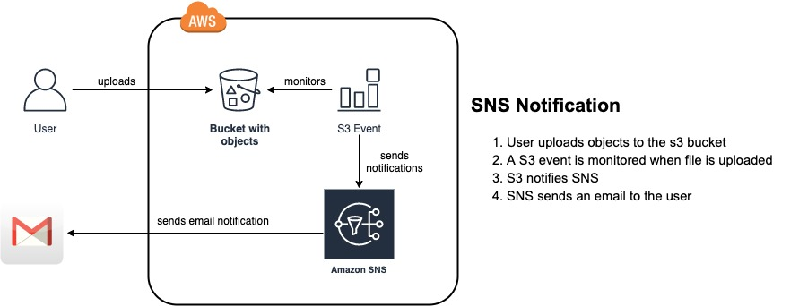

---

### Day 9 - AWS Management

#### November 15, 2020

**Focus**: The learning today focused on CloudTrail, CloudWatch, and CloudFormation

**Progress**:

- Create a CloudWatch event to notify via a SNS topic when an EC2 instance created
- Create a CloudFormation stack using the CloudFormation Designer
- Launch S3 bucket using Infrastructure as Code
- Save and deploy a CloudFormation stack
- View S3 Bucket created by CloudFormation Stack

**Thoughts**: Definitely the best way to get better working in the cloud is to read, create, practice. What do I mean by that? Read and understand the concept, come up with something, draws it, and get your hands dirty and just do it. If you get stuck learn how others did it.

**Work & Resources**:
[AWS CloudFormation](https://docs.aws.amazon.com/AWSCloudFormation/latest/UserGuide/Welcome.html)
[AWS CloudWatch](https://docs.aws.amazon.com/AmazonCloudWatch/latest/monitoring/WhatIsCloudWatch.html)
[AWS CloudTrail](https://docs.aws.amazon.com/awscloudtrail/latest/userguide/cloudtrail-user-guide.html)
[Cloud Formation](https://docs.aws.amazon.com/AWSCloudFormation/latest/UserGuide/Welcome.html)

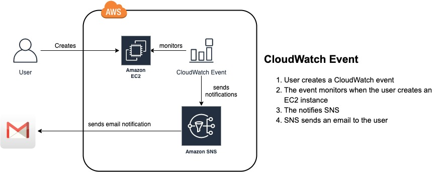

---

### Day 10 - AWS Management

#### November 16, 2020

**Focus**: The learning today focused on the AWS Command Line Interface (CLI)

**Progress**:

- Getting the raspberry pi up and running (no GUI)
- Install the AWS CLI SDK
- Configure the AWS Command Line Interface (CLI)
- Playing around with the AWS CLI commands

**Thoughts**: Knowing which command to type to accomplish a tasks can be challenging. Reading the CLI documention is your best friend. You just have type experimenting with it. When you finally gets it, documenting somewhere.

**Work & Resources**:\
[AWS CLI command reference guide](https://docs.aws.amazon.com/cli/latest/reference/)
[AWS Command Line Interface (CLI)](https://docs.aws.amazon.com/cli/latest/userguide/cli-chap-welcome.html)

---

# Cloud Fundamentals Project

### Day 11 - Deploy Static Website on AWS

#### November 17, 2020

**Focus**: The learning today was to deploy a static web site on AWS.

**Progress**:

- Create an s3 bucket and secures it using IAM Policy
- Create an A record for the website using Route53
- Distribute the web site via CloudFront

**Thoughts**: The bucket IAM policy got the best of me. I assumed granted public access to the bucket, all objects within the bucket will have the same permissions automatically. I kept getting access denied and couldn't figure out the reasons for it. As always reading the AWS documentation helped me formulated the solution.

**Work & Resources**:
[The Travel Blog](travel.sokibi.com)
[The Travel Blog via CloudFront](d1wq0wh5789j4s.cloudfront.net) <--- Disabled to manage cost>
[Setting permissions for website access](https://docs.aws.amazon.com/AmazonS3/latest/dev/WebsiteAccessPermissionsReqd.html)

---

# Deployment Infrastructure as Code

### Day 12 - Getting Started with CloudFormation

#### November 18, 2020

**Focus**: The learning today was focused on DevOps in general.

**Progress**:

- Understanding the problem that DevOops is trying to solve
- Understanding Infrastructure as Code
- Understanding Continuous Integration (CI), Continuous Delivery (CD), Continuous Deployment (CD)
- Getting familiar with DevOps tools such as configuration management tool like (Ansible, etc), deployment tools (Jenkins, Circle CI, etc)

**Thoughts**: It was worth it to take the time to read articles and listen to youtube videos on devops.

**Work & Resources**:\
[Continuous integration vs. continuous delivery vs. continuous deployment](https://www.atlassian.com/continuous-delivery/principles/continuous-integration-vs-delivery-vs-deployment)
[Integration and Continuous Deployment](https://css-tricks.com/continuous-integration-continuous-deployment/)
[DevOps Bootcamp](https://www.youtube.com/playlist?list=PLleOCN2eBn8IhLAckXL0BWomad5lrhB8j)

---

### Day 13 - Getting Started with CloudFormation

#### November 19, 2020

**Focus**: The learning today was on getting my hands dirty with the basic of cloud formation.

**Progress**:

- Learned about CloudFormation template and stack of resources
- Create a YML CloudFormation template
- Create a VPC Resource
- Running the template vis the CLI to create the stack
- Use the CLI to verify the stack created and VPC online

- **Thoughts**: Becoming familiar with the AWS CLI is important. It worth it since this is where I will spend most of my time when working with AWS. The AWS documentation is an indispensable source of knowledge when working with the AWS CLI.

**Work & Resources**:
[AWS::EC2::VPC](https://docs.aws.amazon.com/AWSCloudFormation/latest/UserGuide/aws-resource-ec2-vpc.html)
[AWS resource and property types reference](https://docs.aws.amazon.com/AWSCloudFormation/latest/UserGuide/aws-template-resource-type-ref.html)
[Intrinsic function reference](https://docs.aws.amazon.com/AWSCloudFormation/latest/UserGuide/intrinsic-function-reference.html)
[Pseudo parameters reference](https://docs.aws.amazon.com/AWSCloudFormation/latest/UserGuide/pseudo-parameter-reference.html)

---

### Day 14 - Infrastructure Diagrams

#### November 19, 2020

**Focus**: Todays learning focused on Converting business requirements into infrastructure diagrams and understand the principles behind design choices.

**Progress**:

- Create a Lucid Chart Account
- Setting up a Lucid Chart
- using the diagrams to create a cloud environment

**Thoughts**: The diagram is an important step before writing the code for the environment. I need to able to see what I am write the code for. The diagram helps you to see where the location of services, subnets, route tables, and others within the cloud environment.

**Work & Resources**:
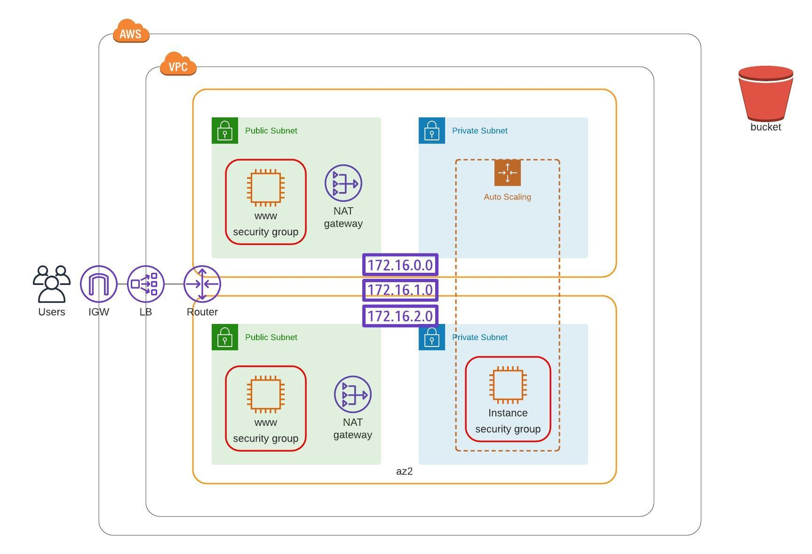

---

### Day 20, 21 - Reading on cloud Architecture

**Thoughts**: During the past two days I decided to read more on cloud architectures. The goal was to get deeper understanding of what the cloud is all about. To learn things like virtualization, load service and deployment models, serverless, etc.

**Work & Resources**:

[Cloud Computing Solutions Architect](http://www.hands-on-books-series.com/cloud-computing-solutions-architect.html)

---

### Day 15 - Task 1 - Create a diagram that represent a corporate-only cloud

#### November 23, 2020

**Focus**: The focus for today was on creating a hybrid cloud environment.

**Progress**:

- Getting familiar AWS diagrams
- Using the previous day diagram and tailor it for a hybrid architecture

**Thoughts**: Today's task involve converting the business requirements into infrastructure diagrams. Once I understand the requirements, it was pretty easy to construct the diagram. It would have been more fun if I worked with another person on this project.

**Work & Resources**:
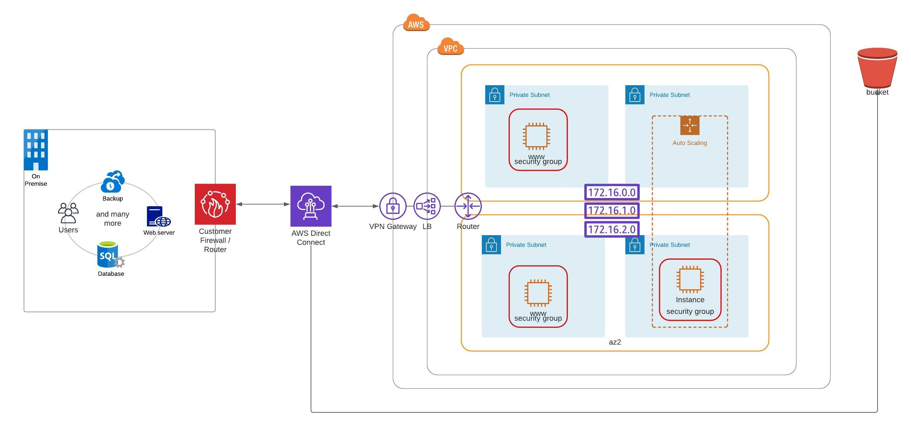

---

### Day 16 - Networking Infrastructure

#### November 24, 2020

**Focus**: The focus for today was converting the diagram I worked on Day 14 to code.

**Progress**:

- Create the cloudformation stack which include the VPC
- Update the stack by adding NET Gatwway, Subnet, and routing
- create an create.sh and update.sh script for creating and updating the stack

**Thoughts**: Today's task involve converting the infrastructure diagram to code.

**Work & Resources**:

[Intrinsic function reference](https://docs.aws.amazon.com/AWSCloudFormation/latest/UserGuide/intrinsic-function-reference.html
)
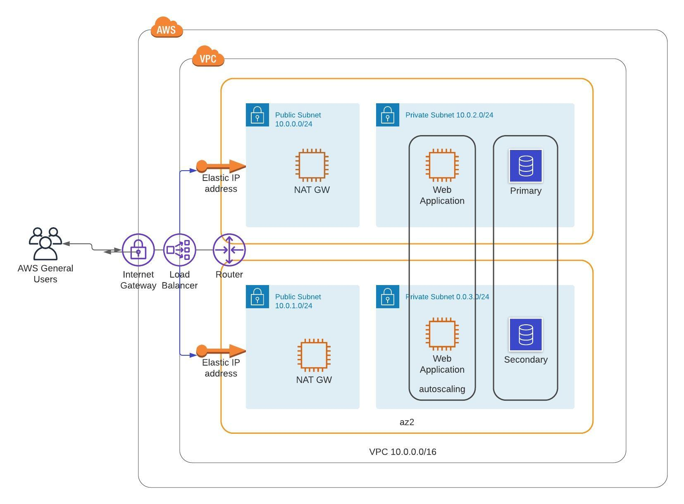

---

### Day 17 - Servers and Security Groups

#### November 25, 2020

**Focus**: Add the necessary components to start deploying servers, application, etc. This is the continuation of the work completed in day 16

**Progress**:

- Creating the security group
- Creating autoscaling group and launch configuration
- Getting familiar and interpreting errors, and steps to fix them

**Thoughts**: It is a joy getting hands-on experience create the code that implements the environment. I purposely made errors in the code that forced me to learn about how cloudformation works. In addition to research and learn what these errors mean.

**Work & Resources**:

[Security Group Rules Reference](https://docs.aws.amazon.com/AWSEC2/latest/UserGuide/security-group-rules-reference.html)

---

### Day 18 - Servers and Security Groups

#### November 30, 2020

**Focus**: Practice creating environment using cloudformation

**Progress**:

- Creating the network infrastructure
- Secure the infrastructure
- Creating EC2 instance
- Deplay an application

**Thoughts**: This just to practice and build confidence.

**Work & Resources**:

- N/A

---

### Day 19 - Storage and Databases

#### December 01, 2020

**Focus**: Adding RDS Database to the infrastructure

**Progress**:

- Create an MySQL database
- Configure the database for replication
- Connecting to the database

**Thoughts**: Setting up the database to prevemt single point of failures makes the environment more robust. Today's learning really stressed that point. Also adding the database in the private subnet provide additional security that prevent unauthorize access to teh data.

**Work & Resources**:

---

## Day 20 - Task 1 - Convert diagram's infrastructure to code

#### December 05, 2020

**Focus**: Reviewing what I have learned from the past few days. Now deploying an Amazon RDS database in a single AZ.

**Progress**:

- Creating VPC
- Creating Internet Gaway
- Creating Subnets
- Creating Route and Route Tables

**Thoughts**: The goal here is to review the learniing and practice what i have learned over the pass several days.

**Work & Resources**:
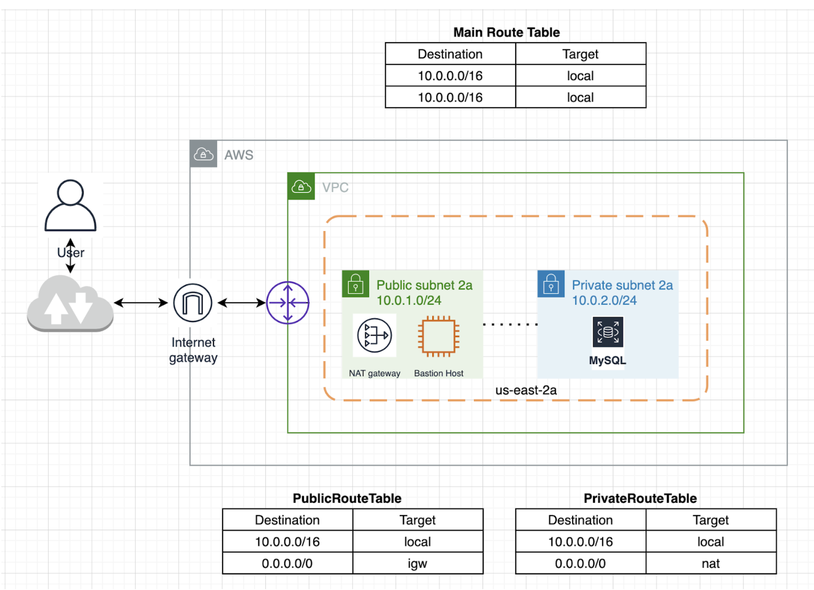

---

## Day 21 - Task 1 - Convert diagram's infrastructure to code

#### December 06, 2020

**Focus**: completed the code for the networking part of day 20

**Progress**:

- Creating the NAT gateway
- Creating the Private Route table
- Attaching Route table to subnets

**Thoughts**: The goal here is to review the learniing and practice what i have learned over the pass several days.

**Work & Resources**:

---

## Day 22 - Task 1 - Convert diagram's infrastructure to code

#### December 07, 2020

**Focus**: adding an RDS MySQL database and redraw the infrastructure diagram. The work involve deploying an Amazon RDS database in a single AZ.

**Progress**:

- Create DB subnet group
- Create RDS DB instance

**Thoughts**: I learned an important lesson today. No matter how much you read, you don't know you know until you create something to practice what you have learned. Here is the story. I spent hours trying to create the MySql RDS instance in the diagram (Day 20). It wouldn't work. It turns the diagram is missing a few pieces. RDS needs at least two subnets in two availability zones. One subnet for the primary and the other for the replicated database. To solve my problem the design needs an additional AZ and at least one subnet.

**Work & Resources**:
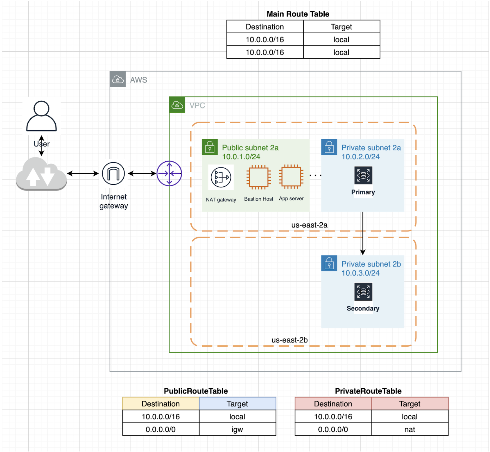

---

## Day 25 - Task 1 - Convert diagram's infrastructure to code

#### December 10, 2020

**Focus**: Completed the coding for the RDS part of the task

**Progress**:

- Adding/revising codes for the DB subnet group
- Adding code for the additional subnet
- Adding/revising codes dor the RDS instance

**Thoughts**: The final infrastructure is not optimal. But the point of this exercise is to simply practice writing cloudformation codes and understand the technology a bit deeper.

**Work & Resources**:

[Infrastructure YML file](https://github.com/pascallaurent/x-days-of-devops/blob/main/resources/code/cloud-formation/task01/infrastructure.yml)

[Servers YML file](https://github.com/pascallaurent/x-days-of-devops/blob/main/resources/code/cloud-formation/task01/servers.yml)

---

# Project

---

## Day 26 - Deploy a high-availability web app using CloudFormation

#### December 11, 2020

**Focus**: Creating architecture diagram

**Progress**:

- Create architecture diagram based on the project requirements
- Create repo for the project
- Push initial version to github

**Thoughts**: Creating the diagram takes a bit of time than anticipated.

**Work & Resources**:

[Project Repository](https://github.com/pascallaurent/landscaping)

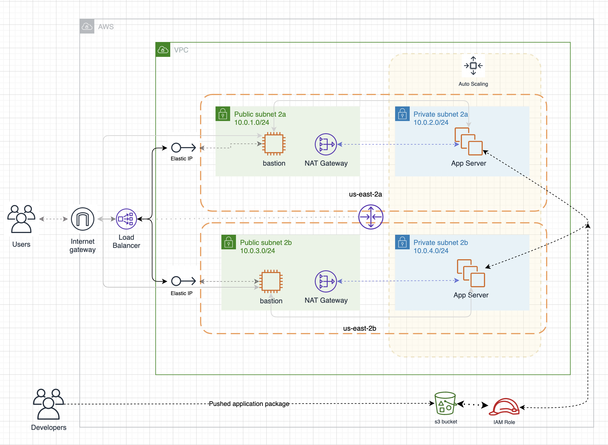
