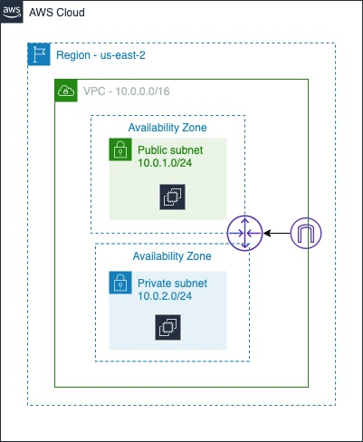

<h1 style="color: #4D774E;">Cloud Fundamentals</h1>

---

<h2 style="color: #F1B24A;">Day 1 - Cloud Computing<h2>

#### November 7, 2020

**Focus**: The focus was on understanding what cloud computing is all about.

**Progress**:

- Creating free-tier account
- Leran the basics of cloud computing
- Learn about cloud deployment models
- Learn about the benefits of these models
- Learn about the shared responsibility model

**Thoughts**:\ Not much hands-on practice today. But learning about cloud computing is refreshing.

**Work & Resources**:\
[Shared Responsibility Model](https://aws.amazon.com/compliance/shared-responsibility-model/)

---

<h2 style="color: #F1B24A;">Day 2 - Foundational & Compute Service<h2>

#### November 8, 2020

**Focus**: The focus for today was on Virtual Private Cloud (VPC).

**Progress**:

- Learn the importance of the VPC
- Lean about subnets, route tables, security groups, internet gateway, etc
- Understanding the default VPC
- Understanding Region and Availability Zone, and their impact
- Creating custom VPC
- Launch EC2 instances and connect to then via ssh

**Thoughts**: Creating a custom VPC was challenging. With persistence and perseverance I was able to get it done. I am longer using the default VPC.

**Work & Resources**:\
[Virtual private cloud](https://en.wikipedia.org/wiki/Virtual_private_cloud)\
[Amazon VPC Documentation](https://docs.aws.amazon.com/vpc/latest/userguide/what-is-amazon-vpc.html)\

---

<h2 style="color: #F1B24A;">Day 3 - Foundational & Compute Service<h2>

#### November 9, 2020

**Focus**: No better way to start with AWS than EC2. Today the learning focuses on EC2 basics and some of the main features it offers. It also touches on storage, auto scaling and load balancing.

**Progress**:

EC2-Basics:

- Learned how to create EC2 instance
- Associate the instance with a security group that allows ssh traffic from any IP
- Create a snapshot of the EBS volume attached to the EC2 Instance
- Create an AMI using the snapshot
- Create a new instance using the AMI

Storage:

- Learn about the different storage class
- Create an EBS volume and attack it to instance
- Create an EFS filesystem and mount it to instance

S3 and IAM Role:

- Create an S3 bucket
- Create IAM Role with EC2 Service
- Attach AmazonS3FullAccess to policy
- Attach role when creating launch configuration

Auto scaling and Load Balancing

- Create launch configuration (useing ami-03657b56516ab7912)
- Create autoscaling group using the launch configuration
- Create target groups
- Create load balancer and have load balancer serves traffic to the instance
- Verify you can see webapp from your browser

**Thoughts**: Doing the lab was refreshing and really cement the concept for me. Navigating the console was a bit intimidating at first. With patience and dedication it becomes easier. Taking the time to draw the architecture prior immersing in the labs was instrumental in connecting the dots.

**Work & Resources**:

---

<h2 style="color: #F1B24A;">Day 4 - Foundational & Compute Service<h2>

#### November 10, 2020

**Focus**: The learning today was focuses on Lambda. I spent a good amount of time experimenting with the lambda function. I did things such as using the parameter passed to the function to stop and restart the instance. I even played around with API gateway that called the lambda function to bring the intance up/down.

## **Progress**:

- Learn the basic of Lambda
- Review the concept of lambda function, event source downstream resources, and log stream
- Create lambda function using the python runtime
- Creaye IAM roles to give the lambda EC2 and cloudwatch access
- Code the lambda function to start/stop an EC2 instance
- Playing around with environment variables

**Thoughts**:

Today working with lambda was fun. I realized there are more to lambda than writing simple functions. It is one area I need to dedicate more time learning.

**Work & Resources**:

[Lambda Function](https://github.com/4zwazo/x-days-of-devops/blob/main/resources/code/lambda/start-start-ec2.py)

---

### Day 5 - AWS Management

#### November 11, 2020

**Focus**: The learning today focused on the AWS Command Line (CLI) Interface

**Progress**:

- Getting the raspberry pi up and running (no GUI)
- Install the AWS CLI SDK
- Playing around with the AWS CLI commands

**Thoughts**: Knowing which command to type to accomplish a tasks can be challenging. Reading the CLI documention is your best friend. You just have type experimenting with it. When you finally gets it, documenting somewhere.

**Work & Resources**:\
[AWS CLI on the Raspberry Pi](https://github.com/4zwazo/x-days-of-devops/blob/main/resources/cli/pi-install.md)\
[AWS CLI command reference guide](https://docs.aws.amazon.com/cli/latest/reference/)\
[AWS Command Line Interface (CLI)](https://docs.aws.amazon.com/cli/latest/userguide/cli-chap-welcome.html)

---

### Day 6 - Storage & Content Delivery

#### November 12, 2020

**Focus**: The learning today focused on S3, DynamoDB, RDS, and CloudFront. I focused in making sure I understand the concept well. I have completed all the labs. It was well worth my time.

**Progress**:

- Create a NoSQL database using DynamoDB
- Create a PostgreSQL database instance using RDS
- Connect and query the databases
- Create a S3 bucket and upload a simple web site to the bucket
- Create a CloudFront distribution for the website

**Thoughts**: The lab makes working with DynamoDB super fun.

**Work & Resources**:
[Introduction to CloudFront](https://www.qwiklabs.com/focuses/14183?catalog_rank=%7B%22rank%22%3A1%2C%22num_filters%22%3A0%2C%22has_search%22%3Atrue%7D&parent=catalog&search_id=7804775)

---

### Day 7 - Security

#### November 13, 2020

**Focus**: The learning today was on security. It stressed the needs on applying best practices to keep your environment and the application running in the cloud secured.

## **Progress**:

- Create an IAM policy

**Thoughts** Today I read a few article about security. This is an important topic I need to immerse myself into.

**Work & Resources**:

[AWS Security Best Practices](https://d1.awsstatic.com/whitepapers/aws-security-best-practices.pdf)

---

### Day 8 - Messaging & Containers

#### November 14, 2020

**Focus**: The learning today was on SNS, SQS, and ECS.

## **Progress**:

- Create a topic, Subscribe to a topic, and publish message to a topic
- Playing around with ECS and SQS

**Thoughts**: I had to spend a good chunk of time study SNS. It was a bit challenging getting the concept ingrained in my brain. As always go to the drawing board save the day.

**Work & Resources**:

---

### Day 9 - AWS Management

#### November 15, 2020

**Focus**: The learning today focused on CloudTrail, CloudWatch, and CloudFormation

**Progress**:

- Create a CloudWatch event to notify via a SNS topic when an EC2 instance created
- Create a CloudFormation stack using the CloudFormation Designer
- Launch S3 bucket using Infrastructure as Code
- Save and deploy a CloudFormation stack
- View S3 Bucket created by CloudFormation Stack

**Thoughts**: Definitely the best way to get better working in the cloud is to read, create, practice. What do I mean by that? Read and understand the concept, come up with something, draws it, and get your hands dirty and just do it. If you get stuck learn how others did it.

**Work & Resources**:
[AWS CloudFormation](https://docs.aws.amazon.com/AWSCloudFormation/latest/UserGuide/Welcome.html)
[AWS CloudWatch](https://docs.aws.amazon.com/AmazonCloudWatch/latest/monitoring/WhatIsCloudWatch.html)
[AWS CloudTrail](https://docs.aws.amazon.com/awscloudtrail/latest/userguide/cloudtrail-user-guide.html)
[Cloud Formation](https://docs.aws.amazon.com/AWSCloudFormation/latest/UserGuide/Welcome.html)

